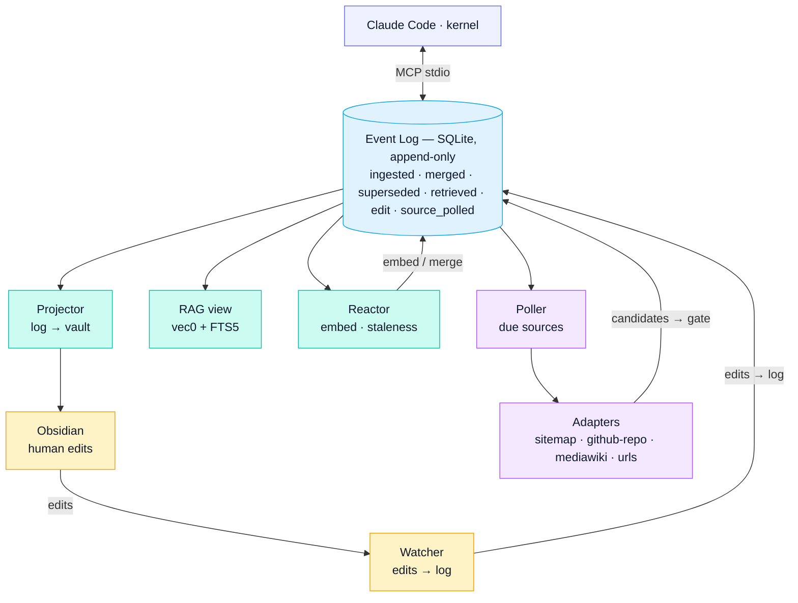

<p align="center">
  <picture>
    <source media="(prefers-color-scheme: dark)" srcset="design/brand/engram-lockup-horizontal-white.svg">
    <source media="(prefers-color-scheme: light)" srcset="design/brand/engram-lockup-horizontal-ink.svg">
    
  </picture>
</p>

**A personal knowledge platform built around an append-only event log, projected into an Obsidian vault, accessed by agents over MCP.**

> **Status:** `v0.1.0` — first public release. While on the `0.x` series, APIs, schema, and on-disk layout may change between minor versions without migration paths.

---

## What it is

Engram is a single-user knowledge system designed to be the long-term memory
layer for an LLM agent (Claude Code in particular, but any MCP-capable client).
It treats:

- **the event log as canonical** — every state change is an immutable event in SQLite,
- **the Obsidian vault as a projection** — markdown files are a materialized view, not source of truth,
- **the human and the agent as peers** — both write through the same dedup gate, both edit the same content.

If the FTS index, vector index, or vault gets corrupted, you replay the log and
rebuild them. The log is the only thing you have to back up.

## What it is not

- **Not multi-user.** No auth, no concurrency model beyond SQLite's WAL.
- **Not cloud-hosted.** Runs entirely on your workstation. Self-hosted research uses a local SearXNG; embeddings run on CPU by default.
- **Not a vector database.** Hybrid retrieval over `sqlite-vec` + FTS5; RRF fused; ranked by source-tier × recency × confidence. If you need a real vector DB at scale, this is the wrong project.
- **Not a Claude API wrapper.** It exposes tools to a kernel (Claude Code or any MCP client). The kernel does the reasoning; Engram is storage and retrieval.

## Quick start

```bash
# 1. Get the code.
git clone https://github.com/nNemLab/engram.git && cd engram

# 2. Initialize (requires uv). Builds ~/.engram/.venv and installs engram into
#    it, then creates ~/.engram/{config.yml,.env,vault,db.sqlite}.
./bin/eos-init

# 3. Wire the MCP server into Claude Code.
claude mcp add -s user engram ~/.engram/.venv/bin/engram-mcp

# 4. Start the daemons (systemd user units; copy them in first — see docs/setup.md).
systemctl --user enable --now \
  engram-projector engram-watcher engram-reactor engram-poller engram-daily-digest.timer

# 5. Optional: register a polled source (see "What you can curate" below).
./bin/eos-source add docker-docs-linux \
  --name "Docker Docs (Linux)" --adapter sitemap \
  --url https://docs.docker.com/sitemap.xml \
  --include '*/engine/*' --schedule 7d
```

Full setup, troubleshooting, and round-trip verification: [docs/setup.md](docs/setup.md).

## What you can curate

Anything text-shaped that you want an agent to remember and reason over. Content
arrives three ways — you write it, the agent writes it, or a polled source feeds
it — and all three land in the same gate.

| You want to keep... | How |
|---|---|
| Your own notes, decisions, episodes | `kb.write`, or drop a markdown file into the vault inbox |
| Docs sites that change over time | `sitemap` source (e.g. Docker, a framework's docs) |
| Wikis | `mediawiki-api` source (Fandom game wikis, Wikipedia, PCGamingWiki, …) |
| A GitHub repo's docs/code tree | `github-repo` source (tracks branch HEAD, incremental via compare API) |
| Research papers | `research.fetch_arxiv` (abstracts + PDFs) |
| One-off pages with no feed | `urls` source, or `research.ingest_url` |
| Web-search findings | `research.search_web` via your local SearXNG, then ingest the keepers |

A polled source is one declarative line. For example, track the Linux-relevant
slice of Docker's docs, re-checked weekly:

```bash
./bin/eos-source add docker-docs-linux \
  --name "Docker Docs (Linux)" --adapter sitemap \
  --url https://docs.docker.com/sitemap.xml \
  --include '*/engine/*' --include '*/desktop/install/linux*' \
  --schedule 7d
```

The poller fetches on its tick, runs every candidate through the dedup gate, and
chains revisions when a page changes (old version stays queryable, vault file
updates in place). Per-source schedules, conditional GETs, and a circuit breaker
keep it polite.

## Online & offline

Engram is **online to gather, offline to use.**

- **Online:** the poller refreshes live sources, `research.search_web` queries
  your SearXNG, and the arXiv/URL fetchers pull new material.
- **Offline:** everything already curated is local — a SQLite database plus a
  markdown vault. Query, read, and edit it with no network. Embeddings run on
  CPU locally, so retrieval works on a plane or an air-gapped box. The poller
  simply pauses and resumes when connectivity returns; nothing else depends on
  the network.

## Privacy-first & human-auditable

- **Self-hosted, single-user, no telemetry.** Runs entirely on your machine.
  There is no cloud backend and no account.
- **Search doesn't leak.** Web search goes through your own SearXNG instance, so
  queries aren't handed to a third-party search API.
- **Everything is an event you can read.** The append-only log is a full audit
  trail — every ingest, merge, supersede, retrieval, and human edit is an
  immutable, timestamped row. Nothing mutates silently, and superseded revisions
  stay queryable rather than being deleted.
- **The store is plain markdown.** The vault is just files in Obsidian:
  human-readable, greppable, diffable, git-able. You can read or correct anything
  by hand, and the watcher makes your edits authoritative.
- **One gate for human and agent.** There is no hidden agent-only memory — you
  and the kernel write through the same path, so you can always see and override
  what the agent stored.

## Architecture



Every content write goes through `dedup.gate()` and produces an `ingested`
event. The reactor embeds and post-checks for near-dups. The projector renders
content rows to the vault. The watcher tails the vault so manual edits in
Obsidian become authoritative.

| Subsystem | Role |
|---|---|
| **Event log** | Append-only SQLite; canonical source of truth, replayable from 0. |
| **Dedup gate** | The single write path: `exact_dup` / `superseded` / `near_dup` / `new`. |
| **RAG** | Hybrid `vec0` + FTS5 retrieval, RRF-fused, ranked by confidence × source-tier × recency. |
| **MCP server** | One stdio server, six tool namespaces (`kb`, `rag`, `research`, `playbook`, `goals`, `sources`). |
| **Projector / Watcher** | Log → vault markdown, and vault edits → log. |
| **Reactor** | Embed-on-ingest, staleness checks, near-dup post-check. |
| **Poller + adapters** | `sitemap`, `github-repo`, `mediawiki-api`, `urls`. |
| **Research** | Self-hosted SearXNG, cross-encoder rerank, arXiv fetcher. |
| **Playbooks** | Jupyter (scratch) / Marimo (curated), run via `playbook.run`. |
| **Daemons** | Four systemd user units + a daily-digest timer. |

Full internals — component-by-component, the confidence model, and failure/recovery
modes: **[docs/architecture.md](docs/architecture.md)**. Event taxonomy:
[docs/event-log-schema.md](docs/event-log-schema.md). Tools:
[docs/mcp-tool-reference.md](docs/mcp-tool-reference.md).

## Configuration

All settings live in `~/.engram/config.yml` (secrets in `~/.engram/.env`),
written by `bin/eos-init`. See **[docs/configuration.md](docs/configuration.md)**
for the full reference — including the embedding/reranker model options and the
CPU-vs-GPU lane choice.

## License

[AGPL-3.0-or-later](LICENSE). If you run a modified version of Engram as a
network service, you must offer your users the modified source under the same
license.
