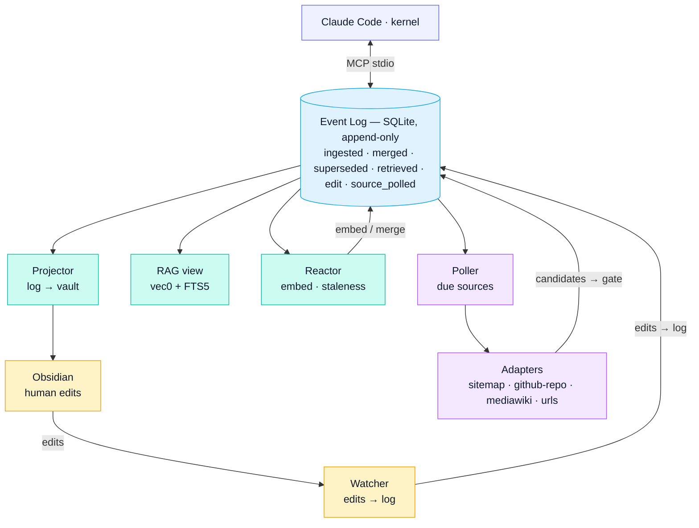

# Architecture

## Principle

The event log is canonical. Everything else — the Obsidian vault, the FTS5
index, the `vec0` embeddings, the entity graph — is a **materialized view**. If
any of those get corrupted, you replay the log from event 0 and rebuild them.
The log is the only thing you have to back up.

Two corollaries shape the whole design:

- **The human and the agent are peers.** Both write through the same dedup gate;
  both edit the same markdown. Neither has a privileged path.
- **Every state change is an auditable event.** Nothing mutates silently — an
  ingest, a merge, a supersede, a human edit, a goal change are all immutable
  rows you can read back in order.

## Data flow



Every content write goes through `dedup.gate()` and produces an `ingested`
event. The reactor embeds and post-checks for near-dups. The projector renders
content rows to the vault. The watcher tails the vault filesystem so manual
edits in Obsidian become authoritative.

## Components

### Event log (`schema/001_initial.sql`, `src/engram/log.py`)

One append-only `events` table. Each daemon keeps a cursor in `daemon_cursors`
and replays forward. Twelve event types are defined; replaying from event 0
reconstructs the system. Full taxonomy: [event-log-schema.md](event-log-schema.md).

### Dedup gate (`src/engram/dedup.py`)

The single entry point for any content write. Returns one of:

- `exact_dup` — SHA-256 collision, no-op.
- `superseded` — same `source_url` already has a live entry with different
  bytes; the old row's `is_current=0`, a new row is inserted with a bumped
  `revision`, a `superseded` event is emitted, and the vault file overwrites in
  place. Old revisions stay queryable.
- `near_dup` — cosine similarity ≥ 0.92 against an existing embedding, merge.
- `new` — inserted, `ingested` event emitted.

Near-dup at write time requires a query embedding and is best-effort; the
reactor does a post-hoc near-dup check after embedding to catch cases the caller
didn't pre-embed.

### RAG (`src/engram/rag/`)

Hybrid retrieval.

- `chunk.py` — splits markdown by structure with a sliding-window fallback.
- `embed.py` — wraps `sentence-transformers/all-MiniLM-L6-v2` (384-dim,
  CPU-friendly; swappable via `config.yml`). Lazy-loaded, normalized float32.
- `query.py` — runs `vec0` ANN and FTS5 in parallel, fuses with Reciprocal Rank
  Fusion, and ranks by `rrf_score × confidence × source_tier_weight ×
  recency_decay`.

Each hit emits a `retrieved` event so the reactor can mark stale entries on
demand (demand-driven refresh).

### MCP server (`src/engram/mcp_server/`)

One stdio server exposing six tool namespaces. Tool handlers run in a worker
thread (`asyncio.to_thread`) so a slow embed doesn't block the stdio loop. Holds
one long-lived SQLite connection.

| Namespace | Tools |
|---|---|
| `kb` | `write`, `get`, `list`, `tombstone`, `contradictions`, `flag_contradiction` |
| `rag` | `query` |
| `research` | `search_web`, `fetch_url`, `ingest_url`, `fetch_arxiv` |
| `playbook` | `list`, `run`, `summarize` |
| `goals` | `set`, `list`, `resolve` |
| `sources` | `add`, `list`, `get`, `set`, `remove`, `fetch_now` |

Full reference: [mcp-tool-reference.md](mcp-tool-reference.md).

### Projector (`src/engram/projector/`)

Tails the log for `ingested`, `merged`, and `superseded` events. Renders content
rows to markdown via per-kind renderers (`kb`, `episode`, `entity`, `research`,
`playbook-summary`). For sourced content (non-null `source_url` + `source_id`),
the vault filename is URL-derived so revisions overwrite the same file in place.
Records rendered bytes in `vault_state` so the watcher can diff against them.
Tombstoned content gets its vault file deleted.

### Watcher (`src/engram/watcher/`)

`watchdog` over the vault. On a debounced modify:

- If the path is in `vault_state`: diff against `rendered_body`, update
  `content.body`, emit a `vault_edit` event. The human's body becomes
  authoritative.
- If unknown: treat as an inbox drop, run through the dedup gate as
  `kind='kb', actor='human'`.

This is the sync-back path that makes manual Obsidian edits authoritative.

### Reactor (`src/engram/reactor/`)

Tails the log. Two handlers wired:

- `on_ingested` — embed the new content, write to `embeddings`, run a post-hoc
  near-dup check that may emit `merged`.
- `on_retrieved` — if a hit is past 80% of its TTL, bump `staleness_score` and
  emit `refresh_requested`.

Add a handler by registering it in `handlers.HANDLERS`.

### Self-hosted research (`research/`, `src/engram/research/`)

- **SearXNG** in Docker (`research/searxng/`) provides web search without
  sending queries to a third party.
- **Cross-encoder reranker** (`ms-marco-MiniLM-L-6-v2`) re-orders SearXNG
  candidates before ingest.
- **arXiv fetcher** (`src/engram/research/arxiv.py`) pulls abstracts and PDFs.
- **`research.ingest_url`** runs server-side (host fetch + extract + dedup);
  **`research.fetch_url`** stamps a body the caller already fetched.

### Source curation (`src/engram/poller/`)

Polled, declarative source subscriptions. `sources.add` registers a feed; the
`engram-poller` daemon picks it up on its 60 s tick, dispatches the named
adapter, and pushes each candidate through the dedup gate. Four adapters:

- **`sitemap`** — walks `sitemap.xml` (incl. sitemap-index files), filters URLs
  through include/exclude globs, fetches with ETag + Last-Modified conditional
  GETs, extracts via trafilatura.
- **`github-repo`** — branch HEAD lookup; first run walks the tree, subsequent
  runs use the GitHub `compare` API for incremental updates. Authenticates via
  `$GITHUB_TOKEN`, falling back to the `gh` CLI credential store (`gh auth
  token`), then to anonymous requests (60 req/hr).
- **`mediawiki-api`** — talks directly to a wiki's `/api.php` (Fandom,
  Wikipedia, PCGamingWiki, ED-Codex, anything MediaWiki). Discovers pages via
  `list=allpages` on first run; tracks updates via `list=recentchanges`
  thereafter. Always sends `maxlag=5` and `assert=anon`. Bypasses Cloudflare
  HTML gating since the API endpoint isn't gated the same way.
- **`urls`** — manually curated list of URLs for sites with no sitemap and no
  API (single articles, reference pages, dashboards). Same conditional-GET
  caching as sitemap.

All four share a `fetch_with_politeness` helper that honors `Retry-After` on
429/503, sends both `If-None-Match` and `If-Modified-Since`, and rate-limits per
source. When upstream content changes, the gate's `superseded` outcome chains
revisions: old rows get `is_current=0` (still queryable), the new row becomes
current, the vault file overwrites in place. Per-adapter schedules and a 5-error
circuit breaker apply. CLI mirror: `bin/eos-source` for shell-side ops without
going through MCP. Specs:
[v0.2 source curation](superpowers/specs/2026-05-06-source-curation-design.md),
[v0.3 adapter expansion](superpowers/specs/2026-05-06-adapter-expansion-design.md).

### Playbooks (`playbooks/`)

Two lanes:

- **Scratch (Jupyter):** notebooks under `playbooks/scratch/`, executed
  headlessly via `papermill`. Default for ad-hoc work.
- **Curated (Marimo):** reactive Python files under `playbooks/curated/`. For
  workflows you want to re-run reproducibly. (Lane exists; no curated playbooks
  ship in `v0.3.0-alpha.1`.)

`playbook.run` writes outputs to `playbooks/runs/<run_id>/`. `playbook.summarize`
pushes a summary string into the KB as `kind=playbook-summary`; the full
notebook stays in the run dir.

### Daemons (`systemd/`)

Four long-running processes installed as user systemd units:

- `engram-projector.service` — log → vault markdown
- `engram-watcher.service` — vault edits → log
- `engram-reactor.service` — embed-on-ingest, staleness, near-dup post-check
- `engram-poller.service` — scan due sources, dispatch adapters, gate candidates

Plus an `engram-daily-digest.timer` that synthesizes the last 24 h of events into
an episode entry (with a per-source curation breakdown when sources are
configured).

## Confidence model

```
confidence = source_tier_weight × recency_decay × stored_confidence

recency_decay = 0.5 ** (age_days / half_life_days)
```

Tier weights and half-life are configured in `config.yml`. Half-life defaults to
365 days; per-entry `ttl_days` overrides it for volatile topics. The retrieval
ranker uses this so ranking stays correct without manual tuning.

## Failure modes and recoveries

| Failure | Recovery |
|---|---|
| Vault file accidentally deleted | Projector renders it again on next ingest/merge tick (it's just a view). |
| FTS5 / embeddings corrupted | Drop the tables; replay log from 0 (handlers re-embed and re-index). |
| Watcher crashed during human edit | Edit becomes authoritative on watcher restart; no event recorded. Live with it, or replay vault → log via `scripts/reconcile_vault.py`. |
| Wrong merge | Manually clear `tombstoned`, emit a corrective event. The log preserves the bad merge for audit. |

## Repository layout

```
engram/
├── schema/                       # 001_initial.sql + 002_sources_and_revisions.sql
├── src/engram/
│   ├── common/                   # config, db connection, migration runner, paths
│   ├── log.py                    # event log read/write
│   ├── dedup.py                  # the gate: SHA-256 + cosine + supersede
│   ├── rag/                      # chunk, embed, hybrid query
│   ├── research/                 # SearXNG, cross-encoder, arXiv
│   ├── poller/adapters/          # sitemap, github-repo, mediawiki-api, urls
│   ├── mcp_server/tools/         # kb / rag / research / playbook / goals / sources
│   ├── projector/                # log → vault markdown daemon
│   ├── watcher/                  # vault edits → log events
│   ├── reactor/                  # event-triggered handlers
│   └── cli/                      # eos-source CLI
├── playbooks/{scratch,curated}/  # Jupyter (default) / Marimo (curated)
├── research/searxng/             # SearXNG docker-compose + config
├── systemd/                      # user unit files for the four daemons + digest timer
├── vault-template/               # initial Obsidian vault layout
├── bin/                          # eos, eos-init, eos-mcp, eos-source, eos-status, ...
├── tests/                        # unit (sources/) + integration/
├── docs/                         # architecture, configuration, schema, MCP tools, setup, specs/
├── design/                       # original design artifacts (frozen)
└── scripts/                      # reconcile_vault, seed_starter_playbooks
```

## Versioning

While in the `v0.x.y-alpha` series, the event-log schema, the on-disk layout
under `~/.engram/`, and MCP tool signatures may all change with no
backward-compatibility guarantees between alpha releases. Migrations are
version-gated via `schema_version`; `init_schema()` applies any `schema/NNN_*.sql`
past the highest applied version on every connect.

Once the alpha series ends, Engram follows [SemVer 2.0.0](https://semver.org/):
breaking schema or MCP changes bump the major; new tools or event types bump the
minor; bug fixes bump the patch. Releases live as git tags on `main`. Design
specs and implementation plans: [superpowers/](superpowers/).
